<picture>
  <source media="(prefers-color-scheme: dark)" srcset="dark.svg">
  <source media="(prefers-color-scheme: light)" srcset="light.svg">
  
</picture>

  

&nbsp;
&nbsp;
&nbsp;

 

&nbsp;
&nbsp;

 

---

Third-year at IIT Madras. The projects here aren't demos — they're shipped. CivicSync won first place at an Anthropic hackathon and processes 23,000+ legislative documents in production. Messy Mashup hits 0.95 macro F1 and runs live on Hugging Face. I'm focused on the parts of AI that break in practice: retrieval that doesn't hallucinate, models that hold up on edge cases, systems that don't quietly fail in production.

**Open to ML / AI Engineering internships.**

 

---

## ⚙️ Projects

 

### 🏆 [CivicSync](https://github.com/22f3003226/Civic-Sync) &nbsp;·&nbsp; *1st Place — Anthropic Hackathon @ IIT Madras*

AI-powered Q&A and summarization tool for Indian parliamentary legislation. Routes 23,000+ documents through a dual-model Claude pipeline — Haiku handles classification and routing, Sonnet handles synthesis — backed by hybrid BM25 + Voyage AI retrieval. Hallucination control is deterministic: every response is grounded in retrieved document chunks, not model memory. That distinction matters when the source material is legal text. Ranked #1 nationally.

-CC785C?style=flat)&nbsp;
&nbsp;
&nbsp;
&nbsp;

[→ GitHub](https://github.com/22f3003226/Civic-Sync) &nbsp;·&nbsp; [→ Live Demo](https://xytan2022-civicsync.hf.space/)

 

---

### 🎵 [Messy Mashup](https://huggingface.co/spaces/xytan2022/messy-mashup) &nbsp;·&nbsp; *0.95 Macro F1 · Deployed*

Multi-class audio genre classifier. An ensemble of four architectures — AST, EfficientNetB0, AudioResNet34, and a custom CNN — all trained on mel spectrograms, merged via soft-vote ensemble. The gap between single-model and ensemble F1 was about 4 points — not massive, but consistent across every class. Deployed and running on Hugging Face Spaces.

&nbsp;
&nbsp;
&nbsp;

[→ GitHub](https://github.com/22f3003226/DL_Messy_Mashup) &nbsp;·&nbsp; [→ Live Demo](https://huggingface.co/spaces/xytan2022/messy-mashup)

 

---

### 📈 WorldQuant India — Quantitative Alpha Research &nbsp;·&nbsp; *All India Rank 17*

Research Consultant role architecting quantitative trading alphas — statistical arbitrage, multi-factor models, and ensemble methods — analyzing 120,000+ financial data fields on the BRAIN platform to surface market inefficiencies with optimized Sharpe ratios. Production-grade ML pipelines in Python for real-time forecasting, feature engineering, and backtesting, validated across bull, bear, and high-volatility regimes.

&nbsp;
&nbsp;
&nbsp;

 

---

### 🎬 [Cinema Audience Forecasting](https://github.com/22f3003226/Cinema_Audience_Forecasting_ML)

Regression pipeline for predicting cinema attendance. The more useful work was in the feature engineering — unpacking how day-of-week effects, seasonal patterns, and release cycles compound before the model even runs. Analysis and EDA done in Pandas, NumPy, matplotlib, and seaborn. Achieved ~0.4 $R^2$, which ended up ranking within top 50 in the competition.

&nbsp;
&nbsp;
&nbsp;
&nbsp;

[→ GitHub](https://github.com/22f3003226/Cinema_Audience_Forecasting_ML)

 

---

## 🛠️ Skills

**ML & AI**

&nbsp;
&nbsp;
&nbsp;
&nbsp;
&nbsp;

**Web & Backend**

&nbsp;
&nbsp;
&nbsp;
&nbsp;

**Data & Databases**

&nbsp;
&nbsp;
&nbsp;

**Infrastructure & Deployment**

&nbsp;
&nbsp;
&nbsp;
&nbsp;

 

---

## 📊 Contribution Activity

&nbsp;
&nbsp;

Consistent shipping across production ML systems, backend infrastructure, and data pipelines.
